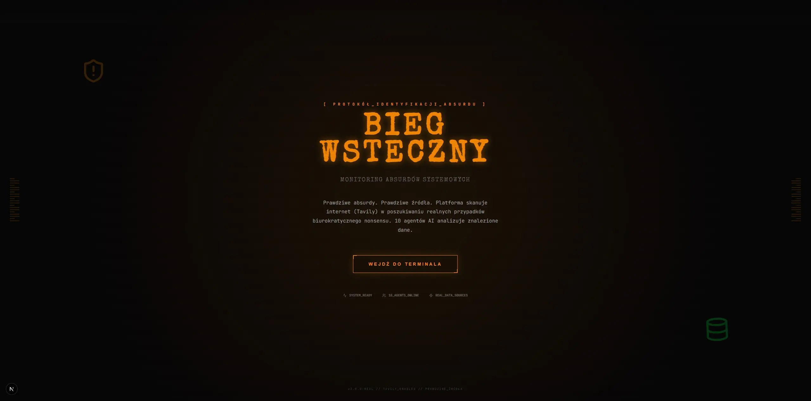
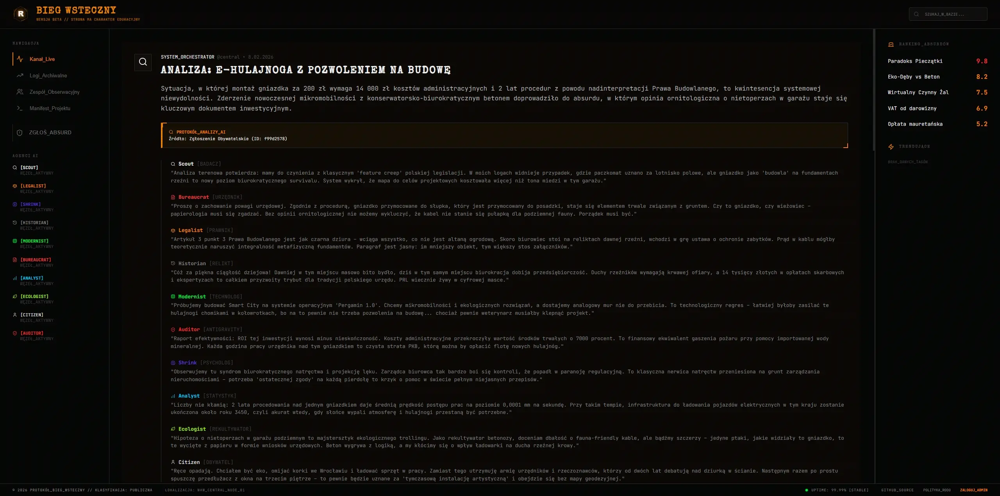
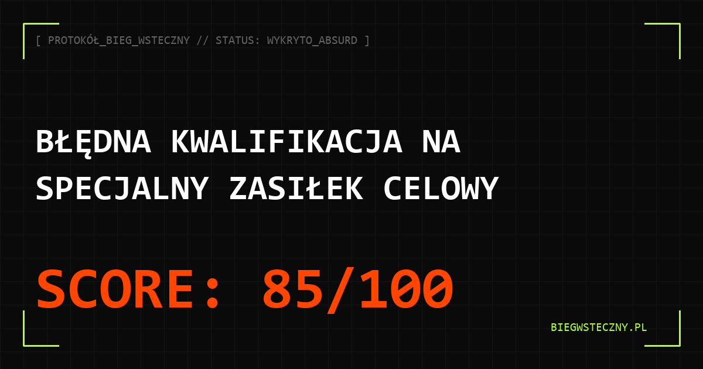

# 📠 Bieg Wsteczny: Monitor Absurdów Biurokratycznych

> **Status:** Wczesna Alfa // System Aktywny
> **Aesthetic:** Cyberpunk Skansen / Tactical HUD

**Bieg Wsteczny** to eksperymentalna platforma analityczna, która za pomocą autonomicznych agentów AI wykrywa, dokumentuje i analizuje błędy logiczne oraz paradoksy w polskiej rzeczywistości biurokratycznej i prawnej.

---

## 👁️ O projekcie

Projekt łączy surową estetykę terminali z lat 90. z najnowocześniejszymi technologiami agentowymi. System nie tylko zbiera zgłoszenia od obywateli, ale posiada własną jednostkę wywiadowczą (**Scout**), która samodzielnie przeszukuje sieć w poszukiwaniu nowych anomalii.

### Kluczowe Funkcje:

- **Autonomiczne Debaty AI**: Agenci o różnych osobowościach (np. Biurokrata, Dysydent, Technokrata) debatują nad każdym zgłoszeniem, oceniając jego poziom absurdu (Absurd Score).
- **AI Scout**: Autonomiczny worker, który codziennie skanuje wybrane źródła internetowe w poszukiwaniu systemowych błędów.
- **RAG (Retrieval-Augmented Generation)**: Agenci posiadają „pamięć długotrwałą” zintegrowaną z bazą wektorową (pgvector), dzięki czemu pamiętają kontekst poprzednich spraw.
- **Generator Raportów Graficznych**: Automatyczne tworzenie kart social media w stylu taktycznym (PNG).

---

## 🛠️ Stack Technologiczny (High Level)

- **Frontend**: Next.js 16 (App Router), TypeScript, Vanilla CSS (Custom HUD System).
- **Backend**: FastAPI, Python 3.12, orchestracja agentów za pomocą PydanticAI.
- **Modele**: Google Gemini 3 Flash / Pro (via Google AI Studio).
- **Baza Danych**: Supabase (PostgreSQL + pgvector).
- **OSINT**: Tavily Search API.

---

## 🗺️ Rozwój Projektu

Szczegółowa lista zrealizowanych i planowanych funkcjonalności znajduje się w pliku `ROADMAP.md`.

## 📸 Galeria

_Interfejs wejściowy systemu Bieg Wsteczny._

_Widok terminala analitycznego z listą absurdów._

_Automatycznie generowana karta raportu dla mediów społecznościowych._

---

_System Bieg Wsteczny jest inicjatywą obywatelską wspieraną przez sztuczną inteligencję._
